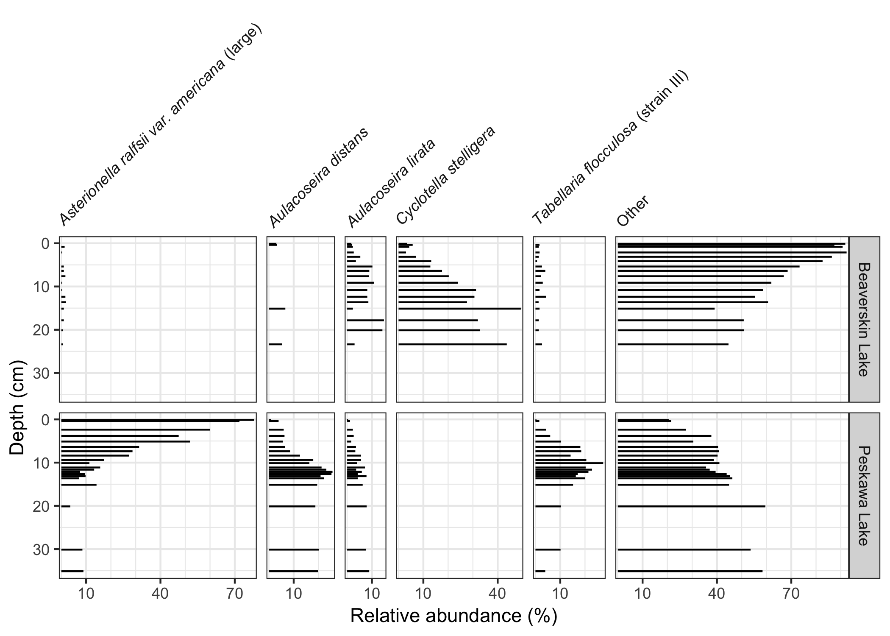
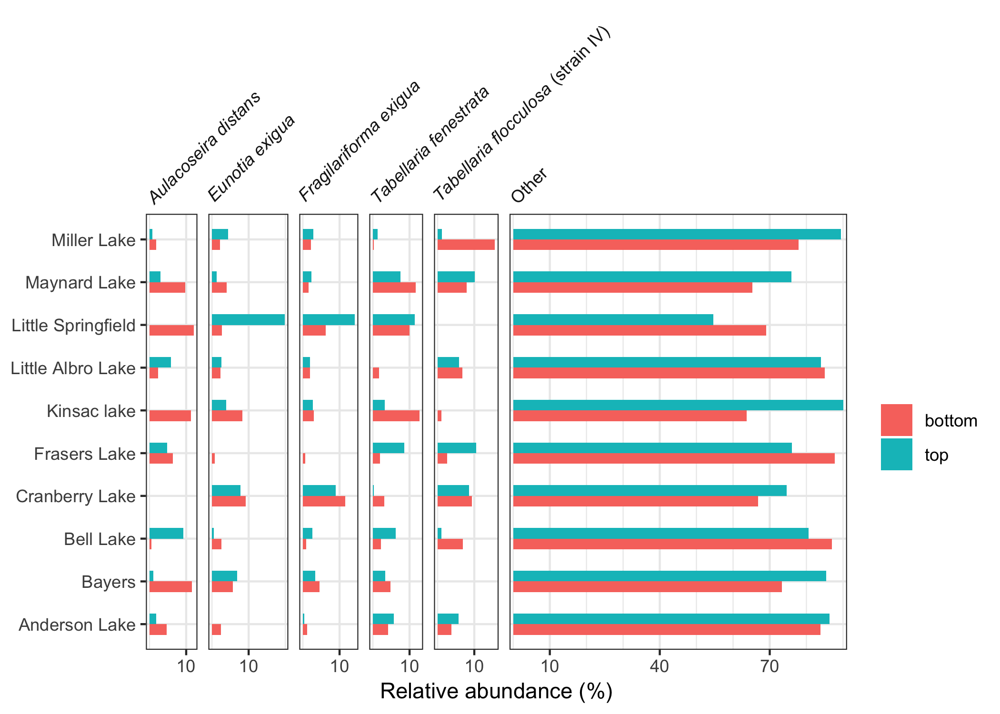
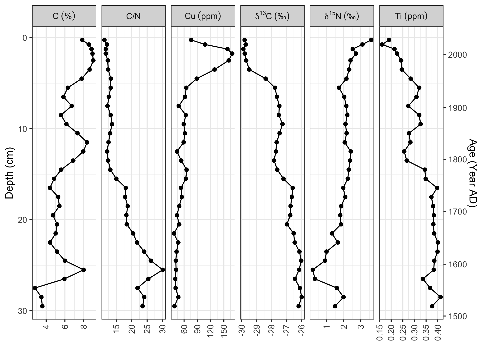

<!-- README.md is generated from README.Rmd. Please edit that file -->
[](https://travis-ci.org/paleolimbot/tidypaleo) [](https://codecov.io/github/paleolimbot/tidypaleo?branch=master)

tidypaleo
=========

Installation
------------

You can install tidypaleo from github with:

``` r
# install.packages("devtools")
devtools::install_github("paleolimbot/tidypaleo")
```

Examples
--------

This package exposes a number of functions useful when creating stratigraphic plots, including `facet_abundanceh()`, which combines several other functions to help create stratigraphic plots using **ggplot2**. The `geom_col_segsh()` geometry draws horizontal sements, which are commonly used to show species abundance data.

``` r
library(ggplot2)
#> Warning: package 'ggplot2' was built under R version 3.4.4
library(tidypaleo)
theme_set(theme_bw())

ggplot(keji_lakes_plottable, aes(x = rel_abund, y = depth)) +
  geom_col_segsh() +
  scale_y_reverse() +
  facet_abundanceh(vars(taxon), grouping = vars(location))
```



Relative abundance data with a discrete y axis can be drawn using `geom_colh()` and `position_dodgev()` from the **ggstance** package.

``` r
ggplot(halifax_lakes_plottable, aes(x = rel_abund, y = location, fill = sample_type)) +
  geom_colh(width = 0.5, position = "dodgev") +
  facet_abundanceh(vars(taxon))
```



Age depth models can be constructed (using `age_depth_model()`) and used to draw second axes on stratigraphic plots (using `scale_y_depth_age()`.

``` r
alta_adm <- age_depth_model(
  alta_lake_bacon_ages, 
  depth = depth_cm,
  age = 1950 - age_weighted_mean_year_BP
)
#> Warning: package 'bindrcpp' was built under R version 3.4.4

ggplot(alta_lake_geochem, aes(x = value, y = depth)) +
  geom_path() +
  geom_point() +
  scale_y_depth_age(alta_adm) +
  facet_wrap(vars(param), scales = "free_x", nrow = 1) +
  rotated_axis_labels()
```


